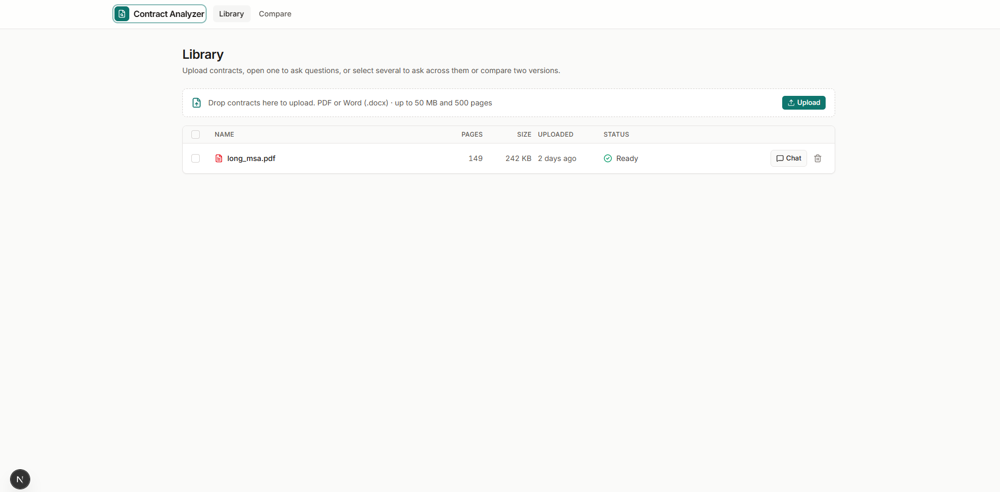
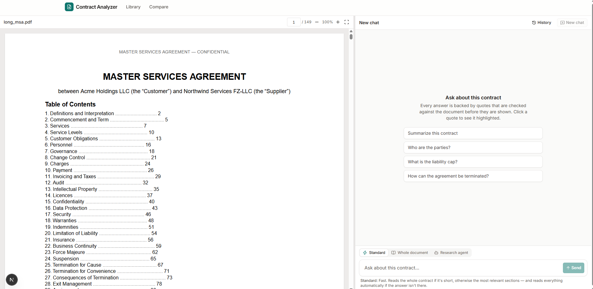
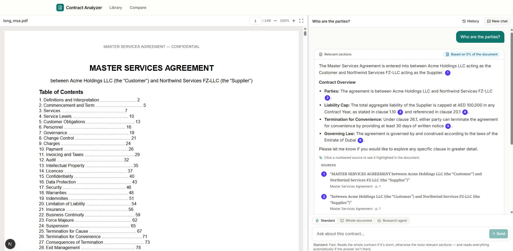
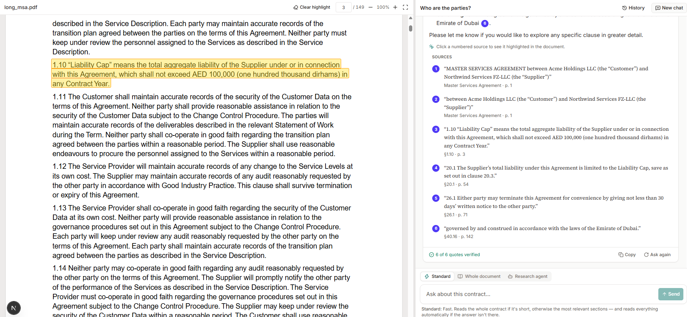
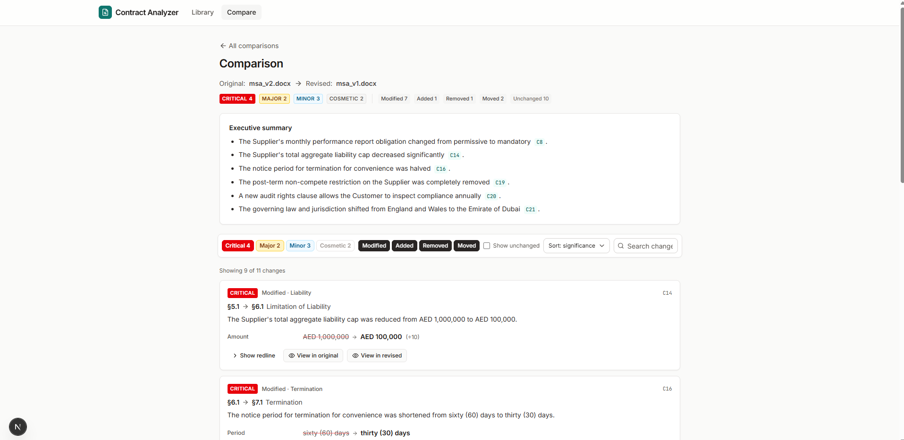

# Contract Analyzer

Upload a contract (PDF or Word), ask questions about it, and get answers backed by **quotes that the app has checked against the document**. Click a quote to jump to that passage, highlighted.

| | |
|---|---|
| **Live app** | _add your Railway URL here_ |
| **Demo video** | _add your Loom / YouTube (unlisted) link here_ |
| **Short note** | [NOTE.md](NOTE.md) |
| **More detail** | [Technical overview + assignment coverage](docs/TECHNICAL.md) · [Test plan with expected answers](docs/TEST_PLAN.md) |

## What it does

- **Upload.** Accepts PDF and DOCX; anything else is rejected with a clear message.
  - Shows live processing progress ("Extracting text: page 83 of 149").
  - A scanned PDF with no readable text is reported as such, never saved as an empty "ready" document.
  - The library lists documents, with **Chat** and **Delete** on each one.
- **Chat.** Answers stream in. **Stop** keeps what was written so far. History is saved per document and can be reopened.
- **Verified quotes.**
  - Every quote the AI writes is searched for in the document by our code before it is shown, allowing for differences in spaces, line breaks, quote marks and hyphenation.
  - Found quotes become numbered sources ①; invented or paraphrased ones are marked **unverified**.
  - If the answer isn't in the document, the app says so.
- **Large documents (150+ pages).** Uses the most relevant sections, or reads the whole document when needed. Every answer shows how much of the document it was based on. The app never says a clause is missing unless it read everything.
- **Citation highlighting.** Clicking a source scrolls the viewer to the passage and highlights it: across line breaks, across page breaks (headers and footers skipped), and with "1 of N" when the text appears more than once.
- **Multi-document questions.** Select several documents and ask one question. The answer compares them, and each quote is tagged with its document (D1, D2…) and checked against that document only.
- **Comparison.** Two versions are compared clause by clause. Each change gets a plain-English summary and a rating (critical, major, minor, cosmetic), with filters and sorting by significance.
- **Part C: research agent (Option 2).**
  - The AI decides what to look up using tools (outline, search, sections, pages, exact phrases, clause list, full check) over several rounds, and you see each step live.
  - Hard limits on rounds, calls, tokens and time; bad tool calls are handled without crashing.
  - The final answer's quotes are verified like every other answer.
- **Installable (PWA)** on desktop and phone, with an offline page. Works on mobile: the chat is full-screen, and tapping a source opens the document at the highlighted passage.

## Screenshots

**Library and upload**


**Chat: start screen with suggested questions**


**Chat with verified quotes** (numbered sources, "Based on N% of the document", Sources list)


**Citation highlighting** (click a source → the passage is highlighted in the document)


**Document comparison** (significance ratings, plain-English summary, facts that changed)


## How it works (short)

- **Next.js** (App Router) runs as **one Node.js process**: the UI, the API routes, a background job worker, and the streamed answers.
- **Supabase** stores the data: Postgres with full-text search and the job queue, plus Storage (a private bucket) for the original files.
  - RLS is on for every table, and the public Data API roles have no access.
  - The Supabase secret key is only used on the server.
- **Gemini** (`@google/genai`) is the AI. The API key, model and (optional) base URL come from environment variables.

See [docs/TECHNICAL.md](docs/TECHNICAL.md) for the full design and how each requirement is met.

## Run it locally

Needs Node 22.13 or newer, a free Supabase project and a Gemini API key.

1. **Supabase:** go to **Connect → Session pooler** and copy the URI (port **5432**, user `postgres.<project-ref>`) into `DATABASE_URL`. Then go to **Settings → API Keys** and copy the **secret key** (`sb_secret_…`) into `SUPABASE_SECRET_KEY`.
2. **Gemini:** create a key at [Google AI Studio](https://aistudio.google.com/apikey) and set `GEMINI_API_KEY`. `GEMINI_MODEL` defaults to `gemini-flash-latest`; `gemini-3.5-flash-lite` is cheap and fast.
3. Run:
   ```bash
   cp .env.example .env       # fill in the values above
   npm install
   npm run db:migrate         # creates the tables and checks RLS
   npm run dev                # http://localhost:3000
   ```
4. Optional checks: `npm run storage:smoke` (Supabase Storage) and `npm run llm:smoke` (Gemini).

Test files are in `tests/fixtures/`:
- `long_msa.pdf`: 149 pages, with facts on pages 3, 71 and 142;
- `msa_v1.docx` / `msa_v2.docx`: two versions for comparison;
- `scanned.pdf`, `partial_scan.pdf`, `encrypted.pdf`, `corrupted.pdf`, `notes.txt`, `legacy.doc`: for the error cases.

## Deploy (Railway)

**Why Railway:** the app needs a server that stays running, for the background worker, long document scans, streamed answers and 50 MB uploads. Railway runs it as a normal Node process. Serverless platforms cut these off.

1. **New project → Deploy from GitHub repo**, then pick this repo and the `main` branch.
2. **Settings → Scale:** choose the region closest to your Supabase project. For Supabase in Seoul (`ap-northeast-2`), pick **Southeast Asia (Singapore)**. Keep **1 replica**, and leave **Serverless off**: the worker must keep running.
3. **Settings → Build:** set Build Command to `npm run build`.
4. **Settings → Deploy:**
   - Start Command: `npm run start`
   - Pre-deploy step: `npm run db:migrate`
   - Healthcheck Path: `/api/health`
5. **Variables:** add everything from `.env.example` with your values, plus `PORT=3000`. Don't use a `NEXT_PUBLIC_` prefix, and set `ENABLE_DEBUG_TOGGLES=false`.
6. **Settings → Networking → Generate Domain** with target port **3000**.
7. Open `https://<your-domain>/api/health`; it should show `"ok": true`.

## Configuration

| Variable | Default | What it's for |
|---|---|---|
| `DATABASE_URL` | required | Supabase **Session pooler** URI (port 5432) |
| `DATABASE_POOL_MAX` | `8` | Max database connections |
| `SUPABASE_URL`, `SUPABASE_SECRET_KEY` | required | Storage for the original files (server only; the legacy `SUPABASE_SERVICE_ROLE_KEY` also works) |
| `SUPABASE_STORAGE_BUCKET` | `documents` | Private bucket (created automatically) |
| `GEMINI_API_KEY` | required | Google AI Studio key |
| `GEMINI_MODEL` | `gemini-flash-latest` | Any Gemini model with tool calling and JSON output |
| `GEMINI_THINKING_LEVEL` | `low` | `minimal` / `low` / `medium` / `high` / `default` (`minimal` is fastest on Flash-Lite) |
| `GEMINI_THINKING_HEADROOM_TOKENS` | `2048` | Extra output room, because thinking tokens count against the limit |
| `GEMINI_BASE_URL` | (empty) | Optional endpoint override |
| `CONTEXT_BUDGET_TOKENS` | `20000` | Max document text per AI request. Kept small on purpose, so long contracts use the large-document strategy. |
| `SCAN_WINDOW_TOKENS`, `SCAN_CONCURRENCY` | `8000`, `4` | Full-document read: part size and parallelism |
| `AGENT_MAX_ROUNDS`, `AGENT_MAX_TOOL_CALLS` | `8`, `20` | Research agent limits |
| `MAX_UPLOAD_MB`, `MAX_PAGES` | `50`, `500` | Upload limits |
| `RUN_WORKER` | `true` | Run the background worker in this process |
| `ENABLE_DEBUG_TOGGLES` | `false` | Allows `?debugInjectFakeQuote=1`, which adds one invented quote to show the "unverified" state |

## Testing

- `npm test` runs about 150 unit tests: quote matching (all the must-accept and must-reject cases), the streaming quote parser, the 149-page PDF, DOCX numbering, highlight geometry, coverage, agent replay with a fake AI sending bad tool calls, comparison rules, Gemini message handling and question intent.
- `npm run e2e` runs an end-to-end check with no real keys: a local Postgres and stand-ins for Storage and Gemini, the production build, HTTP checks, a server-restart recovery check and browser checks in Chrome.
- A manual test plan, with the expected answers for the test files, is in [docs/TEST_PLAN.md](docs/TEST_PLAN.md).

## What's finished and what's not

**Finished and working:**
- **Part A:** upload and processing, chat with streaming and Stop, verified quotes, large documents.
- **Part B:** citation highlighting, multi-document questions, document comparison.
- **Part C:** Option 2, the research agent.
- **Extras:** background processing, which survives a server restart; the installable PWA; the mobile layout.

**Not included:** the other optional extras from the brief (a clause-list screen, export, semantic search, voice input, anonymisation, Arabic). We chose to make Parts A–C solid rather than add unfinished extras.
