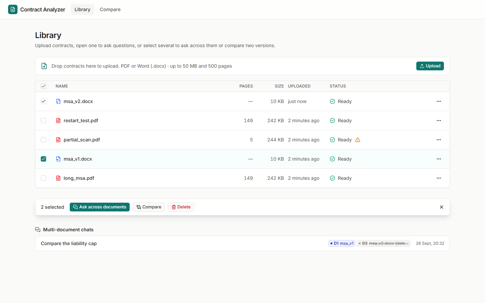
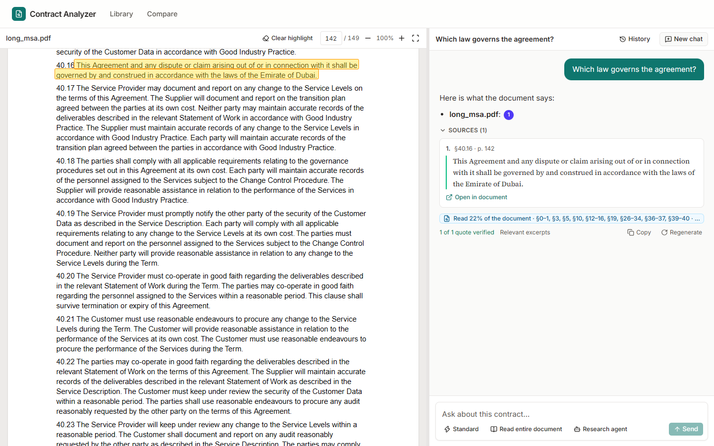
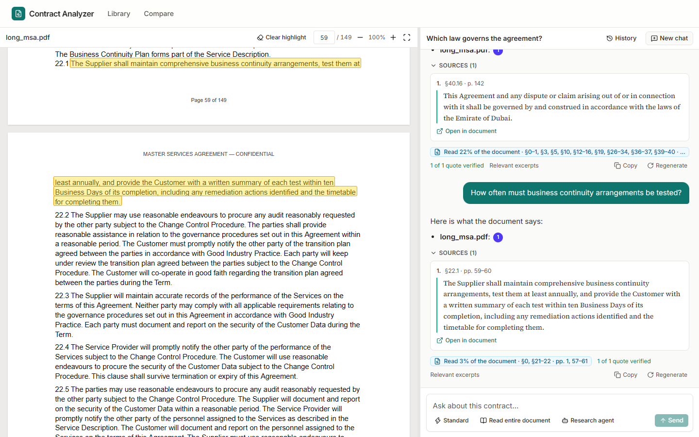
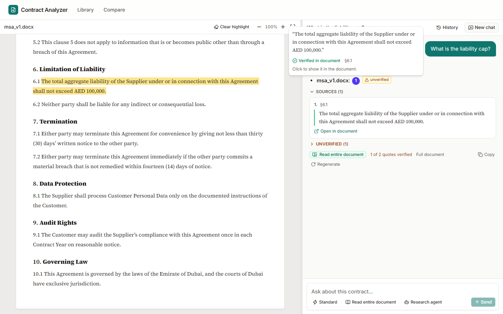
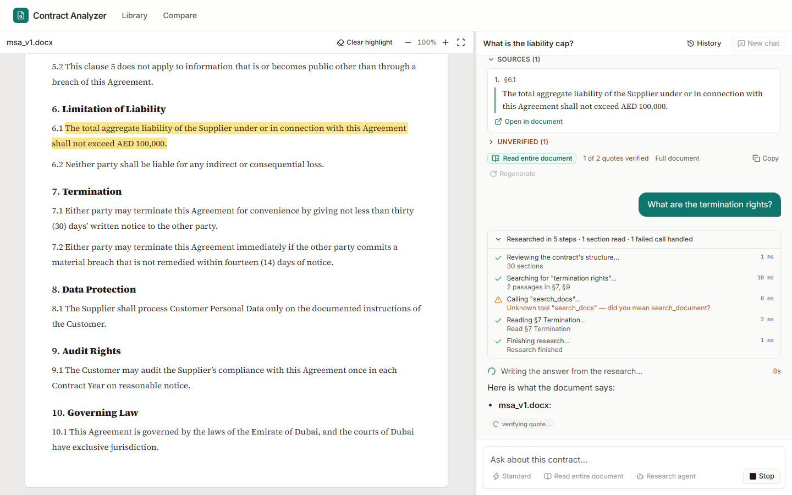
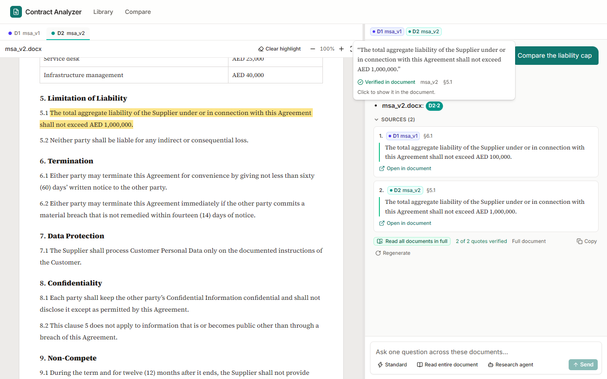
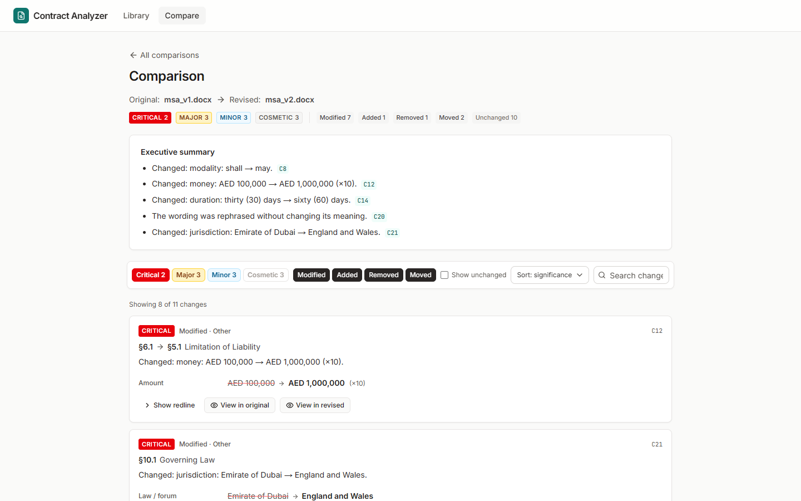

# Contract Analyzer

Ask questions about contracts and get answers backed by quotes that the app itself has checked against the document.

- **Upload** PDF and Word (`.docx`) contracts. Unsupported, damaged, password-protected and scanned (image-only) files get a specific message. They are never saved as empty "ready" documents.
- **Chat** with one contract. Answers stream in, **Stop** keeps the partial answer, and history is saved per document. Every quote is **verified against the document text by our code** before it is shown as a source. Invented or paraphrased quotes are marked *unverified*.
- **Large documents (150+ pages).** The app reads the whole document when it fits the budget. Otherwise it uses excerpts plus an outline, and scans the full document for "is there / any / list" questions or when the excerpts don't hold the answer. Every answer shows how much of the document was read. The app **never says something is absent unless it read the whole document.**
- **Click a quote** to scroll the viewer to it and highlight it. This works across line breaks, across page breaks (skipping headers and footers), and for text that occurs more than once, with a "1 of N" pager.
- **Ask across several documents** (up to 5, tagged D1–D5). Each quote is verified against *its own* document only. **Compare two versions** clause by clause: each change gets a plain-English summary and a significance rating, with filtering by significance.
- **Part C: agentic research** (Option 2). The model uses document tools (outline, search, sections, pages, exact find, clause list, full check) in a real multi-round loop. It shows live progress, runs under hard caps, and handles bad tool calls without failing. Its final answer goes through the same verifier.

Live app: _not deployed yet, see [Not finished](#whats-finished-whats-not)_ · Demo video: _not recorded yet_

## Screenshots

> These were captured with the local end-to-end harness ([Testing](#testing)). It uses real Postgres, the real UI and real pdf.js, but a **scripted stand-in for Gemini**, so the answer wording and the comparison summaries are placeholder text. Replace these with screenshots from the live app.

| | |
|---|---|
| Library, with a two-document selection |  |
| Verified quote highlighted on page 142 |  |
| Highlight across a page break (header and footer skipped) |  |
| DOCX: a verified quote and an invented one shown as *unverified* |  |
| Research-agent timeline |  |
| Multi-document answer; clicking a D2 quote switches the viewer tab |  |
| Comparison with significance filters |  |

## Architecture

```
Browser (Next.js App Router, React)
  │   REST (JSON) + streaming answers (text/event-stream over fetch POST)
  ▼
Next.js server: ONE Node.js process (runtime = 'nodejs')
  ├─ Route handlers /api/*        thin: parse → call lib service → respond
  ├─ Chat engine                  standard (full | retrieval | scan) and agent modes
  │     └─ LLM client             Gemini via @google/genai (generateContent / generateContentStream)
  ├─ Quote verifier               in-memory match indexes (LRU cache per document)
  └─ Background worker            polls the `jobs` table; started from instrumentation.ts
        ├─ job: process-document  (validate → extract → structure → chunk → index → clauses)
        └─ job: compare-documents
  ▼
Supabase
  ├─ Postgres: documents, document_pages, sections, chunks (tsvector), clauses,
  │            conversations, conversation_documents, messages, comparisons, jobs
  └─ Storage (private bucket "documents"): the original uploaded files
```

Key decisions:

- **Supabase for data, Railway for the app.** The app needs a long-running process (background worker, multi-minute scans, streamed agent loops) and uploads up to 50 MB. Serverless function limits rule out Vercel for this.
  - The server talks to Postgres **directly** (Drizzle over the Session pooler). Full-text search, `FOR UPDATE SKIP LOCKED` job claims and bulk inserts are awkward through the REST client.
  - `@supabase/supabase-js` is used **only for Storage**, on the server, with the **secret key**.
  - Every public table has **RLS enabled with no policies**, and `anon`/`authenticated` privileges are revoked, so the Data API exposes nothing. The app connects as the owner role.
  - No login: the assignment assumes a single user.
- **Gemini through the official Google Gen AI SDK** (`@google/genai`), using the stateless `generateContent` / `generateContentStream` API. We own conversation history, so each call carries its full context.
  - Structured outputs use `responseJsonSchema`, generated from the same zod schemas that validate the reply.
  - Agent tools use `parametersJsonSchema`.
  - Model turns that contain function calls are replayed **verbatim**, so thought signatures survive.
  - Thinking tokens count against `maxOutputTokens`. Every call therefore gets headroom (`GEMINI_THINKING_HEADROOM_TOKENS`) and a low thinking level by default.
  - A `RECITATION` or safety stop becomes a visible notice rather than a silently truncated answer.
- **Libraries:**
  - pdf.js (`pdfjs-dist`) on the server for text and per-item geometry, and the same version in the browser via `react-pdf`, so the highlight geometry lines up.
  - A custom OOXML parser for DOCX, so Word auto-numbering (`1.`, `1.1`, `(a)`) appears in the canonical text and in the rendered HTML (`mammoth` is the fallback).
  - Postgres full-text search for retrieval.
  - `diff` for redlines.
- **Why Option 2 (agentic research) over Option 1 (tracked-change redlining):**
  1. It builds on the core. The tools are thin wrappers over indexes we already build (sections, full-text search, page and character offsets), and the final answer goes through the same quote verifier.
  2. Its correctness is testable with deterministic replay tests: caps, malformed tool calls and forced final answers.
  3. Option 1 is mostly an OOXML engineering problem with no JS library to lean on. Correct `w:ins`/`w:del` across split runs, without disturbing numbering, styles or tables, was the bigger risk in the time available.

## Running locally

Requires Node ≥ 22.13.

1. **Supabase.** Create a free project, or run one locally with the Supabase CLI (`supabase start`).
   - *Connect → Session pooler* gives `DATABASE_URL` (port 5432).
   - *Settings → API Keys* gives the **secret key** (`sb_secret_…`) as `SUPABASE_SECRET_KEY`. The legacy `service_role` JWT still works as `SUPABASE_SERVICE_ROLE_KEY`, but Supabase is retiring legacy keys.
   - The private `documents` bucket is created automatically at server start (or with `npm run storage:setup`).
2. **Gemini.** Create an API key in [Google AI Studio](https://aistudio.google.com/apikey) and set `GEMINI_API_KEY`. `GEMINI_MODEL` defaults to `gemini-flash-latest`. Pin a specific model id (for example a Flash-Lite model) for predictable cost.
3. Run:
   ```bash
   cp .env.example .env        # fill in the values above
   npm install                 # also copies the pdf.js worker/cMaps/fonts into public/pdfjs
   npm run db:migrate          # applies migrations and checks RLS is on for every table
   npm run storage:smoke       # optional: upload → download → delete round-trip
   npm run dev
   ```
4. After migrating, run **Advisors → Security Advisor** in the Supabase dashboard. It should report no issues for the `public` tables.

Fixtures (regenerate with `npm run fixtures`) are committed in `tests/fixtures/`:
- `long_msa.pdf` (149 pages; facts on pages 3, 71 and 142; a clause across a page break; running header and footer);
- `msa_v1.docx` / `msa_v2.docx` (real Word numbering, with the v2 changes listed in the build plan);
- `scanned.pdf`, `partial_scan.pdf`, `encrypted.pdf`, `corrupted.pdf`, `notes.txt`, `legacy.doc`.

## Deploying (Railway + Supabase)

1. **Supabase:** create the project, then run `npm run db:migrate` locally with the production `DATABASE_URL`, or add it as Railway's pre-deploy command. The migrations:
   - enable pgvector and RLS on every table;
   - revoke Data API privileges;
   - try to create the bucket (the app also creates it at startup).
2. **Railway:** create a service from the repo with the default Node builder.
   - Build command: `npm run build`. Start command: `npm run start` (`next start` binds to Railway's `PORT`).
   - Set the variables from `.env.example`. None of them may use the `NEXT_PUBLIC_` prefix.
   - Health check path: `/api/health` (checks the database, Storage bucket and worker).
   - Run a **single instance**: the active-answer registry lives in memory.
3. The server reads pdf.js cMaps and fonts from `node_modules/pdfjs-dist` at runtime. The default `next start` setup has them. If you switch to `output: 'standalone'`, copy them explicitly.

## Configuration

| Variable | Default | Purpose |
|---|---|---|
| `DATABASE_URL` | required | Supabase **Session pooler** connection string |
| `DATABASE_POOL_MAX` | `8` | Max DB connections (stay within the pooler's client limit) |
| `SUPABASE_URL` / `SUPABASE_SECRET_KEY` | required | Storage access (server only; legacy `SUPABASE_SERVICE_ROLE_KEY` accepted) |
| `SUPABASE_STORAGE_BUCKET` | `documents` | Private bucket for original files |
| `GEMINI_API_KEY` | required | Google AI Studio API key |
| `GEMINI_MODEL` | `gemini-flash-latest` | Any Gemini model with function calling and JSON output |
| `GEMINI_THINKING_LEVEL` | `low` | `minimal`, `low`, `medium`, `high` or `default` (support varies by model) |
| `GEMINI_THINKING_HEADROOM_TOKENS` | `2048` | Added to every call's output cap, because thinking tokens count against it |
| `GEMINI_BASE_URL` | (empty) | Endpoint override (proxy or local test double) |
| `CONTEXT_BUDGET_TOKENS` | `20000` | Max document tokens sent in one answer call. **Deliberately small**, so a 150-page contract always uses the retrieval/scan strategy even though Gemini's context window could hold it. |
| `SCAN_WINDOW_TOKENS` / `SCAN_CONCURRENCY` | `8000` / `4` | Full-document scan window size and parallelism |
| `AGENT_MAX_ROUNDS` / `AGENT_MAX_TOOL_CALLS` | `8` / `20` | Hard caps for the research agent |
| `MAX_UPLOAD_MB` / `MAX_PAGES` | `50` / `500` | Upload limits (Supabase free plan: 50 MB per file) |
| `RUN_WORKER` | `true` | Run the background worker in this process |
| `ENABLE_DEBUG_TOGGLES` | `false` | Enables `?debugInjectFakeQuote=1`, which appends one invented quote so the *unverified* state can be shown |

## Testing

- **`npm test`** runs about 130 unit tests (vitest) covering:
  - quote normalisation and verification (the full must-verify / must-reject table, including paraphrases, changed amounts, protected words and elision order);
  - the streaming quote parser, split at every character index;
  - PDF extraction on the 149-page fixture: headers and footers, the cross-page clause, table-of-contents skip, facts on pages 3/71/142, and chunk boundaries;
  - DOCX numbering;
  - highlight boxes across pages and coverage maths;
  - agent replay tests with a scripted fake LLM: an unknown tool, invalid JSON, invented arguments, a nonexistent section, duplicate calls, repeated failures, a model that never stops, and the token and call caps;
  - the comparison invariants, facts and significance floors;
  - Gemini message conversion (thought-signature replay, function-response grouping) and the JSON Schema clean-up.
- **Queue integration tests** (`tests/integration`) run against a real Postgres when `DATABASE_URL` is set: atomic claims, lease-expiry recovery, and backoff.
- **End-to-end harness** (`npm run e2e`) starts a real Postgres (PGlite over the wire protocol), a stand-in for Supabase Storage and a scripted stand-in for Gemini's REST API. It then runs migrations, builds and starts the app, and:
  - runs 64 HTTP checks: uploads and rejections, live stages, all chat modes, stop, multi-document, agent, comparison and delete;
  - runs 15 browser checks in your installed Chrome: real pdf.js rendering, a citation click that scrolls to page 142, a two-page highlight, the DOCX highlight, the unverified state, the agent timeline, the multi-document tab switch, comparison, and the mobile layout.

  It needs no real API keys. What it *can't* show is how well the real Gemini model answers. That needs the manual pass on the live app (build plan §18.3).

## What's finished, what's not

**Finished and verified locally (tests plus the e2e harness):** all of Parts A–C as listed at the top, plus the "background processing" extra. If the server is killed mid-processing, the job's lease expires, another worker claims it, and the document reaches *ready*. The harness demonstrates this.

**Not finished yet:**
- Not yet run against a real Supabase project and the real Gemini API from this environment, because no credentials were available. Every Gemini request shape and every Supabase call is exercised against local stand-ins that follow the documented REST protocols, but run the manual test pass after configuring `.env`.
- Not deployed; no live URL, final screenshots or demo video yet.
- Optional extras not built: LLM clause extraction and a Clauses tab, export, semantic (embedding) search, voice input, anonymisation, Arabic/RTL. Clause *indexing* is keyword-based and feeds the agent's `list_clauses` tool.

**Known limitations:**
- Multi-column PDFs can interleave columns: pdf.js content-stream order is kept, not re-sorted.
- PDF highlight rectangles inside a text item use proportional character widths, so they are an approximation on justified text.
- DOCX headers, footers, footnotes and comments are not indexed. Word numbering is approximated (common list formats, restarts and overrides).
- No OCR: scanned pages are reported and always count as unread.
- Comparison: a clause split in two, or two clauses merged, shows as modified plus added (or removed). A heavily reworded clause without a shared number or title may show as removed plus added.
- Token counts for budgets use an OpenAI tokenizer as an estimate for Gemini, so budgets keep a margin.
- One app instance only (the in-memory active-answer registry). A page refresh during generation leaves the partial answer saved as *interrupted*; it doesn't reconnect.

## Note: how it works and where it can fail

**Quote verification.**
- Each document is reduced to one canonical text. PDF items and DOCX runs map to character offsets in it, and page headers and footers are detected and kept as "furniture" ranges.
- The model's quote and the text are normalised with an offset map back to the original: Unicode NFKC; quote, dash and space variants; soft hyphens; de-hyphenation across line and page breaks; furniture skipped.
- Matching tries four tiers in order: exact normalised → compact (letters and digits only, plus a numeric guard) → elided segments that must appear in order → a ≥ 0.95 fuzzy match. The fuzzy tier only allows one-character typos in long, non-numeric, non-"shall/may/not" words.
- The displayed quote is always **the document's own text**, and the model's page numbers are never used.
- In multi-document chats a quote is checked only against the document its tag names. A quote found in a different document is shown as unverified ("found in D2").
- Where it can fail:
  - PDFs whose fonts extract to the wrong characters;
  - multi-column reading order;
  - quotes spanning unusual table layouts;
  - furniture misdetected on very short documents;
  - near-identical boilerplate, where the highlight can land on the wrong occurrence (all occurrences are offered);
  - the deliberate one-typo tolerance.

**Large documents.**
- The budget is deliberately small, so a 150-page contract always goes through retrieval: keyword search with query variants, phrase and section-number boosts and RRF fusion, plus the whole outline.
- Exhaustive or "not found" questions trigger a map-verify-reduce scan of every part. Each finding is verified as it arrives.
- Coverage is tracked per answer. Failed scan windows and scanned pages are always disclosed, and a server-side check adds a warning if an answer claims absence without full coverage.

**Part C.**
- Eight tools over the existing indexes.
- A ledger of caps (rounds, tool calls, tokens and wall clock), checked *before* each call.
- Every tool call gets a result (validation errors come back as structured results), duplicate calls hit a cache, and repeated failures are stopped.
- When a cap is hit, the model is forced into a final answer, written with tools disabled, that states what it read.
- The hardest part was making that forced answer honest about coverage and keeping models from guessing section numbers. The tools return "did you mean" hints, and the prompt forbids concluding absence without `check_entire_document`.

**Next steps:** OCR, Option 1 redlining on top of the DOCX run model, reconnectable streams, clause split/merge detection in comparison, and an evaluation set of real long contracts.
